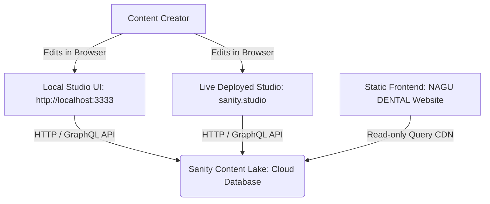

# Sanity CMS Integration Walkthrough

This document serves as a personal reference for understanding the architecture, configuration, and workflows of the Sanity CMS Studio setup for Nagu Dental.

---

## 1. Why We Ran Each Command

### Project Initialization
```bash
npm create sanity@3.99.0 -- --project exi81qhl --dataset production --template clean --typescript --output-path studio-nagu-dental-cms
```
* **Why `@3.99.0` instead of `@latest`?** The latest Sanity Studio v4 (packages version 6+) requires Node.js `>=20.19.1` (and prefers `v22+`). Since your environment runs Node.js `v20.10.0`, using the latest stable `sanity@3.99.0` (Studio v3) ensures compatibility while providing all robust features.
* **`--project exi81qhl`**: Links the local Studio to your existing remote Sanity project ID.
* **`--dataset production`**: Sets the default dataset to `production` (where all live website data will live).
* **`--template clean`**: Bootstraps an empty studio layout with no pre-configured mock schemas, letting us build clean schemas from scratch.
* **`--typescript`**: Configures type safety for schemas and studio configurations.
* **`--output-path studio-nagu-dental-cms`**: Specifies the name and location of the directory where the Studio code is generated.

### Running the Local Studio
```bash
cd studio-nagu-dental-cms
npm run dev
```
* Starts the Vite-powered local development server. The Studio UI compiles and becomes available at `http://localhost:3333/`.

---

## 2. Directory and File Layout

Here is the purpose of the key files and directories created under `studio-nagu-dental-cms/`:

* **`sanity.config.ts`**: The main configuration file for the Sanity Studio. It defines plugins (like `structureTool` and `visionTool`), projects, datasets, and registers schemas.
* **`sanity.cli.ts`**: Used by the CLI tool itself when running commands (like building or deploying). It contains the Project ID and dataset configuration so the CLI knows where to push builds.
* **`schemaTypes/`**: The folder where all content types (documents, objects, singletons) are defined.
  * **`index.ts`**: The entrypoint that exports all schema definitions in a single array `schemaTypes` to be registered by `sanity.config.ts`.
* **`static/`**: Folder for static assets (such as the Studio favicon or logos) that Vite serves directly.
* **`package.json`**: Lists dependencies (like `sanity` and `react`) and script definitions.
* **`tsconfig.json`**: TypeScript compiler configuration.

---

## 3. Architecture: How Local Studio Connects to Sanity Cloud

Sanity CMS splits the **content management interface (Studio)** from the **database/content API (Content Lake)**.



### Local vs. Cloud Storage
* **Local Storage**: ONLY the Studio code, configuration files, and schema layouts are stored locally (in git). **No client content is stored on your hard drive.**
* **Cloud Storage**: All content (text, images, files, references) is sent to and stored in the **Sanity Content Lake** (the cloud database hosted by Sanity).

### How Authentication Works
1. When you run `sanity login` (or run initialization for the first time), the CLI starts a temporary local web server (usually on port `4321`) and opens a web browser link pointing to Sanity's central login system.
2. Once you log in (via Google, GitHub, or Email), Sanity's server issues an auth token and redirects your browser to `http://localhost:4321/callback?token=...`.
3. The local CLI server reads this token and stores it in your machine's global user config directory (`~/.config/sanity/config.json`).
4. Every subsequent local CLI run or `sanity dev` session automatically reads this local config file to authenticate API calls to the Sanity Content Lake.

### How Studio Communicates with the Cloud
* The local Studio is a Single Page Application (SPA) built using React.
* When you open `http://localhost:3333/` in a browser, the application runs client-side.
* It uses the `projectId` and `dataset` defined in `sanity.config.ts` along with your browser's session cookie (established during login) to make authenticated HTTP requests to `api.sanity.io` to read and write your data.

---

## 4. How Schemas, Content, and Publishing Work

### Schemas
Schemas define the data structure of your CMS. A schema is defined as a TypeScript object using `defineType` and `defineField`:
```typescript
import {defineType, defineField} from 'sanity'

export default defineType({
  name: 'service',
  title: 'Service',
  type: 'document',
  fields: [
    defineField({
      name: 'title',
      title: 'Service Title',
      type: 'string',
    }),
  ],
})
```
* **Documents** represent top-level content collections (e.g. an FAQ post, a Service, a Testimonial) or singletons (e.g., Site Settings).
* **Fields** represent individual properties (strings, numbers, images, arrays, references).

### Content and Publishing
* **Drafts**: As you type inside the Studio UI, changes are instantly saved to the cloud database as a `draft.` document.
* **Publishing**: When you click the **Publish** button in the Studio, Sanity copies the draft document's content to a live document (e.g. replacing `drafts.service-id` with `service-id`). Only published documents are visible to the public API by default.

---

## 5. How Your Static Website Will Fetch Content

Since your website is a static HTML/CSS/JavaScript site, you will fetch content directly from the browser using the Sanity client CDN or native `fetch` requests.

### Option A: Using native `fetch` (Zero Dependencies)
You can query content using Sanity's query language, **GROQ** (Graph Relational Object Queries), by hitting their public HTTP API endpoint directly:

```javascript
const PROJECT_ID = 'exi81qhl';
const DATASET = 'production';
const QUERY = encodeURIComponent('*[_type == "testimonial"]{ author, quote }');
const url = `https://${PROJECT_ID}.api.sanity.io/v2021-10-21/data/query/${DATASET}?query=${QUERY}`;

fetch(url)
  .then(res => res.json())
  .then(data => {
    // data.result contains your array of testimonials
    console.log(data.result);
  });
```

### Option B: Using the official `@sanity/client` CDN
You can include the Sanity client from a CDN in your HTML file:

```html
<script src="https://cdn.jsdelivr.net/npm/@sanity/client@6.1.3/dist/index.umd.min.js"></script>
<script>
  const client = window.SanityClient.createClient({
    projectId: 'exi81qhl',
    dataset: 'production',
    apiVersion: '2021-10-21', // Use current date or matching API version
    useCdn: true, // true enables caching CDN for sub-millisecond response times
  });

  async function loadServices() {
    const services = await client.fetch('*[_type == "service"]{ title, description }');
    console.log(services);
  }
  loadServices();
</script>
```

---

## 6. Common Commands Reference

Run these commands inside the `studio-nagu-dental-cms/` directory:

* **`npm run dev`**: Starts the local development Studio server at `http://localhost:3333/`.
* **`npx sanity login`**: Logs into your Sanity account globally.
* **`npx sanity logout`**: Logs out of your current session.
* **`npx sanity build`**: Compiles the Studio into static assets inside the `dist/` folder (useful for manual web hosting).
* **`npx sanity deploy`**: Builds and deploys the Studio directly to Sanity's free hosting servers (making it accessible live at `your-name.sanity.studio`).
* **`npx sanity manage`**: Opens your Sanity project's cloud management dashboard in your browser.

---

## 7. Notes and Best Practices

1. **Avoid Hardcoding Tokens**: Always keep your client read queries public. Only use Write/Read tokens securely if you are building an interactive app with form submissions. For fetching static site data, no token is needed.
2. **Version Control**: Do not commit the `node_modules` directory. Keep `.gitignore` intact.
3. **CORS Origins**: Before your static website can fetch data from Sanity, you **must** add your website's URL (e.g. `http://localhost:5500` or `https://your-domain.com`) to the allowed CORS origins list. You can do this by running `npx sanity manage`, navigating to **Settings > API settings > CORS Origins**, and adding the URL.
